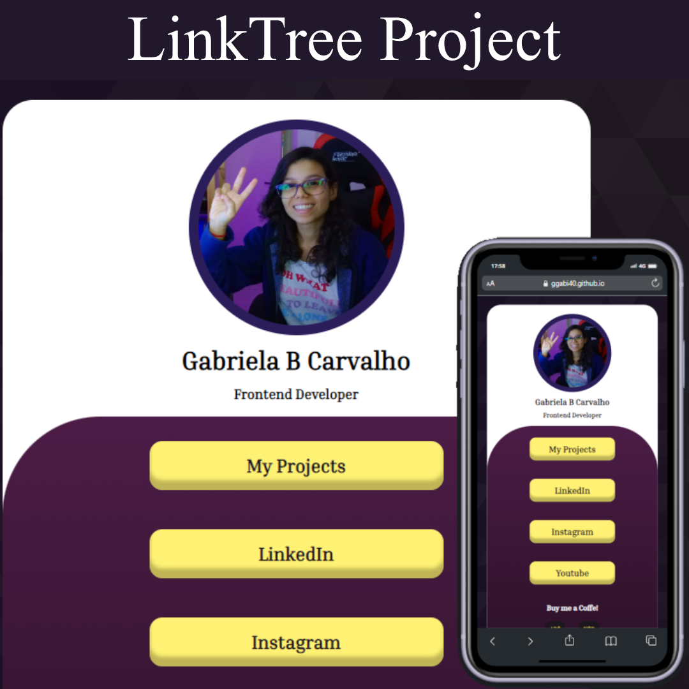

<h1>LinkTree</h1>

 

This project was made with the intention of grouping all the links in one place and with a personalized URL.

I was able to put into practice all my knowledge about responsiveness and I am happy with the result.

<h2>Linktree</h2>

 

<h2>📚Tecnologies:</h2>

<ul>
<li>HTML</li>
<li>CSS3</li>
<li>Git and Github</li>
</ul>

 

<h2>💻Project:<h2>

Visit the project Online: <a href="https://ggabi40.github.io/linktree">ggabi40.github.io/linktree</a>

 

Desenvolved by GGabi40.

